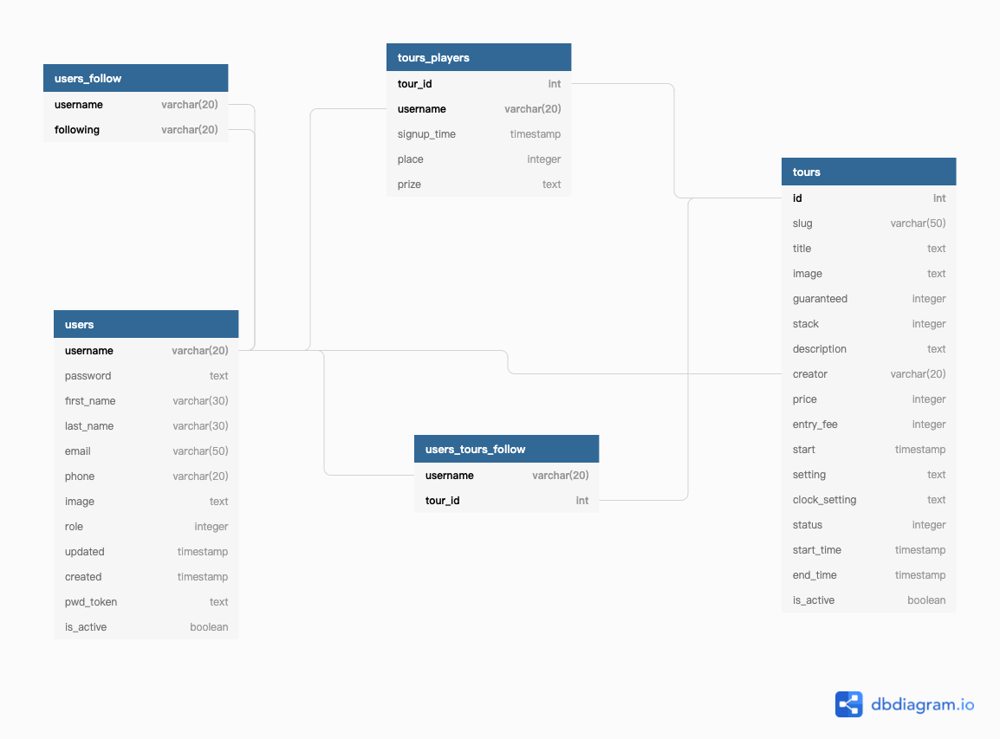

#  **Tour For All**

Estimated Hours: 40 Hours

I have been working as a poker dealer for over 10 years. Every day I work I need to deal poker tournament and looking at the tournament clocks all the time. An idea came up to me I want to make my tournament clock one day and share it with everyone. 

Here is the project. Everyone can find tournaments and see the clocks online. Tournament hosts can run the same tournament in different rooms even in different cities, everyone would see the same clock with the same information no matter where you are. 

- ##  What tech stack will you use for your final project? 
  - Front end : React.js
  - Back end : express.js
  - Database : PostgreSQL
  - File Storage : AWS S3
  - API Calls : axios
  - Realtime Communication : WebSocket

- ## Is the front-end UI or the back-end going to be the focus of your project? Or are you going to make an evenly focused full-stack application?

  - Front-end UI will be the focus of this project.

- ## Will this be a website? A mobile app? Something else?

  - This will be a single-page website.

- ## What goal will your website be designed to achieve?

  - Users can register accounts.
  - Users can create tournaments from the templates provided or create one all by themselves.
  - Users can join tournaments and get notifications when the tournament starts.
  - Everybody can see the published tournament on the front page. Would show the upcoming events and the result of past events.
  - Everybody can see the tournament clock online when the tournament starts.
  - Tournament creator has full control of the tournament clock. Everybody else would see the real-time update when he/she makes some change.

- ## What kind of users will visit your site? In other words, what is the demographic of your users?

  - Poker tournament players, who want to join some private tournament.
  - Poker tournament host, who are hosting some private tournament. Especially the poker clubs.

- ## What data do you plan on using? You may have not picked your actual API yet, which is fine, just outline what kind of data you would like it to contain.
   
  - All the users and tournament information would be stored in the database.
  - Users would get notifications via email or text message (not sure which API to used yet).
  - Files would be uploaded to AWS S3 as files uploaded to Heroku would be deleted after 1 day.

- ## In brief, outline your approach to creating your project (knowing that you may not know everything in advance and that these details might change later). Answer questions like the ones below, but feel free to add more information:

  - ### a. What does your database schema look like?
    - 
    - All tournament setting information will store as json in tournament.setting
    - All tournament clock information will store as json in tournament.clock_status, for recoverage in case of the creator losing connection.

  - ### b. What kinds of issues might you run into with your API?
    - Text messages may not work with free accounts of some APIs.

  - ### c. Is there any sensitive information you need to secure?
    - User password, address, and emails.

  - ### d. What functionality will your app include?
    - List of tournaments. Including upcoming events and past events. Coming with live search.
    - publish tournaments. From a template or create a blank new one.
    - Tournament clock, tournament creator can start, pause, end, go forward, go backward, change how many players left, change the prize pool. Every update would be shown in real-time for others.
    - User registration and login.
    - User center. Including published tournaments, joined tournaments, and prize information if they have been in the prize of some tournaments.
  - ### e. What will the user flow look like?
    - Tournament creator publish the tournament.
    - Poker players join tournaments.
    - When the tournament starts, the tournament creator starts the clock and everyone in the world would see it in real-time. 
    - Tournament creator ends the clock when the tournament ends and updates the prize information.
    - Prize information would be published at the past events.

  - ### f. What features make your site more than CRUD? Do you have any stretch goals?
    - The feature that makes the difference is the real-time tournament clock. Everyone can see the same clock in real-time no matter where you are.

    - Stretch goals:

      - Make the poker tournament game online.