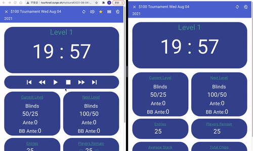
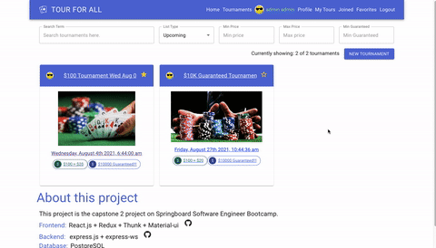

# Tour For All

I have been working as a poker dealer for over 10 years. Every day I work I need to deal with poker tournaments and looking at the tournament clocks all the time. An idea came up to me I want to make my tournament clock one day and share it with everyone.

Here is the project. Everyone can find tournaments and see the real-time updated clocks online. Tournament hosts can run the same tournament in different rooms even in different cities, everyone would see the same clock with the same information no matter where you are.


## Authors

Sunbao Wu[@yb7984](https://www.github.com/yb7984)  
Email: [bobowu@outlook.com](mailto:bobowu@outlook.com)  
Linkedin: [https://www.linkedin.com/in/sunbao-wu/](https://www.linkedin.com/in/sunbao-wu/)


## Tech Stack
[](https://nodejs.org/en/)
[](https://reactjs.org/)
[](http://expressjs.com/)
[](https://www.postgresql.org/)

[](https://github.com/facebook/create-react-app)
[](https://testing-library.com/docs/react-testing-library/intro/)
[](https://reactrouter.com/web/guides/quick-start)
[](https://redux.js.org/)
[](https://github.com/rt2zz/redux-persist)
[](https://github.com/reduxjs/redux-thunk)

[](https://material-ui.com/)
[](https://www.npmjs.com/package/jsonwebtoken)
[](https://github.com/axios/axios)
[](https://momentjs.com/)

[](https://aws.amazon.com/s3/)
[](https://www.npmjs.com/package/bcrypt)
[](https://www.npmjs.com/package/jsonschema)
[](https://www.npmjs.com/package/express-ws)
[](https://www.heroku.com)
[](https://surge.sh/)

  
## Demo
- [Tour For All Frontend](http://tourforall.surge.sh/) hosted on [Surge](https://surge.sh/)
- [Tour For All Backend](https://tourforall.herokuapp.com/) hosted on [Heroku](https://www.heroku.com/)


## Github
- Frontend: [tour-for-all-react](https://github.com/yb7984/tour-for-all-react)
- Backend: [tour-for-all-express](https://github.com/yb7984/tour-for-all-express)

## Screen shot & Video
- Running Clock
  
  []

- Copy Tournament
  
  []
  
  
## Components

| Component                     | Route        | Description                                         |
| :---------------------------- | :----------- | :-------------------------------------------------- |
| `App`                         |              | The main container of this whole app.               |
| -- `Navbar`                   |              | Navigation bar for this whole app.                  |
| -- `Footer`                   |              | Project introduction for this whole app.            |
| -- `Loading`                  |              | Component to show when loading data.                |
| -- `ConfirmDialog`            |              | Component to show confirmation message.             |
| -- `Error`                    |              | Component to show when something unexpected happen. |
| -- `ImageUpload`              |              | Component to handle image file upload.              |
| -- `SnackAlert`               |              | Component to show alert message.                    |
| -- `UserChip`                 |              | Component to show user avatar and na                |
|                               |              |                                                     |
| -- `Routes`                   |              | Component that contains all the routes.             |
| ---- `HomePage`               | /            | Homepage                                            |
| ------ `TourListWidget`       |              | Homepage tour list component.                       |
| ---- `Login`                  | /login       | Login page.                                         |
| ---- `Signup`                 | /signup      | Sign up page.                                       |
| ---- `Profile`                | /profile     | Profile update page.                                |
|                               |              |                                                     |
| ---- `Tours`                  | /tours       | Tour list page. default to  upcoming tours.         |
| ------ `TourSearchForm`       |              | Tour search form                                    |
| ------ `TourList`             |              | Tour list component                                 |
|                               |              |                                                     |
| ---- `MyFavorites`            | /myfavorites | Favorite tour list page.                            |
| ------ `TourSearchForm`       |              | Tour search form                                    |
| ------ `TourList`             |              | Tour list component                                 |
|                               |              |                                                     |
| ---- `MyJoined`               | /myjoined    | Joined tour list page.                              |
| ------ `TourSearchForm`       |              | Tour search form                                    |
| ------ `TourList`             |              | Tour list component                                 |
|                               |              |                                                     |
| ---- `MyTours`                | /mytours     | My created tours page.                              |
| ------ `TourSearchForm`       |              | Tour search form                                    |
| ------ `TourList`             |              | Tour list component                                 |
| -- `TourAddForm`              |              | Tour creating form.                                 |
|                               |              |                                                     |
| Components in `Tour`          |              |                                                     |
| -- `TourListItem`             |              | Tour list item component                            |
| -- `Tour`                     |              | Tour detail page.                                   |
| ---- `TourDetail`             |              | Tour detail page.                                   |
| ------ `TourPlayerList`       |              | Show all the joined players.                        |
| ------ `TourStructure`        |              | Show the tournament structure.                      |
| ---- `TourClock`              |              | Tour Clock page.                                    |
| ------ `TourClockActions`     |              | Tour Clock control buttons.                         |
| ------ `TourClockIndicators`  |              | Tour Clock status indicator.                        |
| ------ `TourClockLevel`       |              | Tour Clock level indicator.                         |
| ------ `TourClockPlayersLeft` |              | Tour Clock remain players indicator.                |
| ------ `TourClockTimer`       |              | Tour Clock main timer.                              |
| ---- `TourEditForm`           |              | Tour edit form                                      |
| ------ `TourSettingForm`      |              | Tour setting input form                             |
| ---- `TourCopyButton`         |              | Tour copy button.                                   |
| ---- `TourDeleteButton`       |              | Tour delete button.                                 |
| ---- `TourFollowButton`       |              | Tour follow button.                                 |
| ---- `TourJoinButton`         |              | Tour join button.                                   |
| ---- `TourRefreshButton`      |              | Tour refresh button.                                |


## Database schema


## API Reference

Please check it out at [tour-for-all-express](../tour-for-all-express).

## Environment Variables

To build this frontend project, you will need to update the following environment variables at package.json
```json
{
    "scripts":{
        "build":"REACT_APP_BASE_URL=https://tourforall.herokuapp.com REACT_APP_BASE_WS_URL=ws://tourforall.herokuapp.com REACT_APP_S3_UPLOAD=true REACT_APP_BASE_S3_URL=https://tourforall.s3.amazonaws.com react-scripts build",
    
    }
}
```

Then, you can just run `npm run build`
